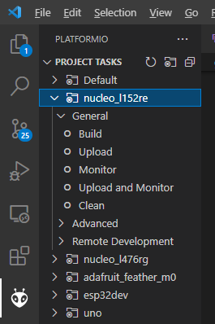

# Generic LoRa Node

## Description

This project builds open Arduino as the framework and [Arduino-LMIC](https://github.com/mcci-catena/arduino-lmic/) (LoRa-MAC-in-C) to create a firmware which gives a user easy access to LoRa and LoRaWAN functionality, such as configuring ABP or OTAA keys, sending LoRaWAN packets, receiving LoRaWAN packets, etc. 

In short this means that you can grab any of the supported development boards you like, connect a LoRa radio to it, flash the firmware onto the dev board and start sending LoRa packets.

## Supported Hardware

LoRa radios:
* Semtech SX1276
* Semtech SX1272
* RFM95 (which is a SX1276 clone), e.g. [this Adafruit module](https://learn.adafruit.com/adafruit-rfm69hcw-and-rfm96-rfm95-rfm98-lora-packet-padio-breakouts/overview)

Boards and microcontrollers:
* STM32 ones, e.g. [Nucleo L152RE](https://os.mbed.com/platforms/ST-Nucleo-L152RE/), [Nucleo L476RG](https://os.mbed.com/platforms/ST-Nucleo-L476RG/)
* [ESP32](https://github.com/espressif/arduino-esp32#esp32dev-board-pinmap)
* Atmel SAMD boards (e.g, the handy [Adafruit Feather M0 with RFM95 radio](https://learn.adafruit.com/adafruit-feather-m0-radio-with-lora-radio-module/overview))
* possibly many more since it justs builds on Arduino + LMIC.


## Firmware Compilation and Flashing

This project is designed to be compiled with [PlatformIO](https://platformio.org/) as the build system. To obtain PlatformIO, 
1. Go the commandline way: `pip3 install platformio` ([docs](https://docs.platformio.org/en/latest/core/installation.html#python-package-manager)), or
2. Go the IDE way: [Download](https://code.visualstudio.com/download) and install VSCode, then [add the PlatformIO extension](https://docs.platformio.org/en/latest/integration/ide/vscode.html#installation) to it from the marketplace

The project can then be interacted with from either the CLI or the IDE.

First, you need to know which PlatformIO environment you are building for. Each corresponds to a certain board / microcontroller. They are listed in the [platformio.ini](platformio.ini) as `[env:<environment name>]`. For example, the environment for the Nucleo L152RE board is `nucleo_l152re`.

In VSCode's [project task list](https://docs.platformio.org/en/latest/integration/ide/vscode.html#project-tasks), all environments are listed, and when expanded show the "Build" and "Upload" buttons to respectively compile and upload the project for that specific environment.



If you are working from the CLI, use `pio run -e <environment>` for building and `pio run -e <environment> -t upload` accordingly ([docs](https://docs.platformio.org/en/latest/core/quickstart.html#process-project)).

## Hardware Hookup and Configuration

The hardware should consist of a development board (with on-board USB-UART chip or the MCU being USB capable) with one of the LoRa radios listed above connected to it.

The pins to which the radio should be connected to is listed in [`src/HardwarePinConfig.cpp`](src/HardwarePinConfig.cpp). Note that the SPI connections should always be made to the default pins that the Arduino core's SPI library uses. 

In the example of the (STM32) [Nucleo-L152RE](https://os.mbed.com/platforms/ST-Nucleo-L152RE/#board-pinout) board with a [Adafruit RFM95 breakout board](https://learn.adafruit.com/adafruit-rfm69hcw-and-rfm96-rfm95-rfm98-lora-packet-padio-breakouts/pinouts), this means:
* Nucleo's 5V to radio's VIN pin (breakout board has voltage regulator on-board, 5V can source more current..)
* Nucleo's GND to radio's GND pin
* Nucleo's SCLK to radio's SCLK pin (as labelled on the Arduino-compatible header of the Nucleo)
* Nucleo's MISO to radio's MISO pin 
* Nucleo's MOSI to radio's MOSI pin 
* Nucleo's D10 to radio's CS pin (as dictated by the `HardwarePinConfig.cpp`)
* Nucleo's D3 to radio's G0 pin (G0 = DIO0)
* Nucleo's D4 to radio's G1 pin
* Nucleo's D5 to radio's RST pin

## User Manual

## Usage example

## Adding another board

Your board is not listed in the `platformio.ini`? Try looking up the board in [PlatformIO's board list](https://platformio.org/boards) and adding a new environment for it, in accordance to what the other environments do. For example, for the [Nucleo F103RB](https://docs.platformio.org/en/latest/boards/ststm32/nucleo_f103rb.html) board, add 

```ini
[env:nucleo_f103rb]
platform = ststm32
board = nucleo_f103rb
framework = arduino
lib_deps = ${common_env_data.lib_deps_always}
```

to the `platformio.ini` and build for that environment. Many boards supporting Arduino are likely fully compatible.

## Media

A Nucleo-L152RE board with a Adafruit RFM95 breakout board attached to it, running the firmware.

## Current State

Implemented:
* [x] LoRaWAN key configuration (OTAA, ABP)
* [x] LoRaWAN packet sending with configurable payload and FPort
* [x] Setup repeated transmissions
* [ ] Using ADR
* [ ] Sending / Receiving on a fixed channel (currently uses all available channels)
* [ ] continuous receive (Class-C dvevice)
* [ ] Continous Wave (CW) test output
* [ ] Sending and receiving raw LoRa packets