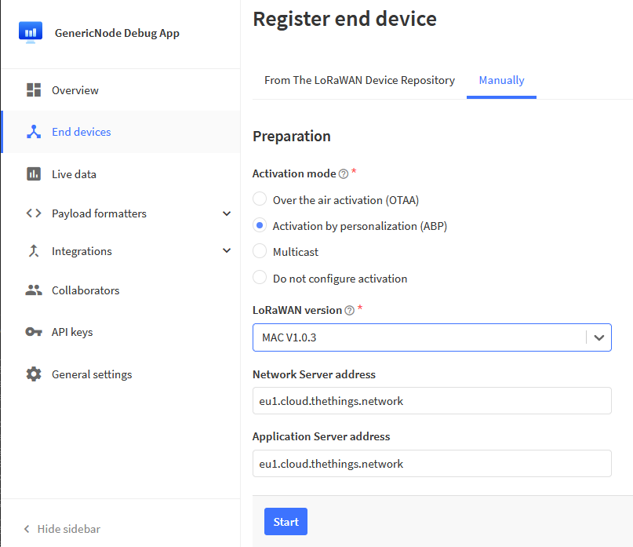
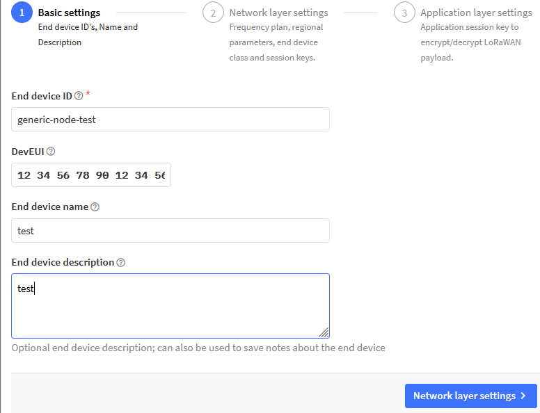
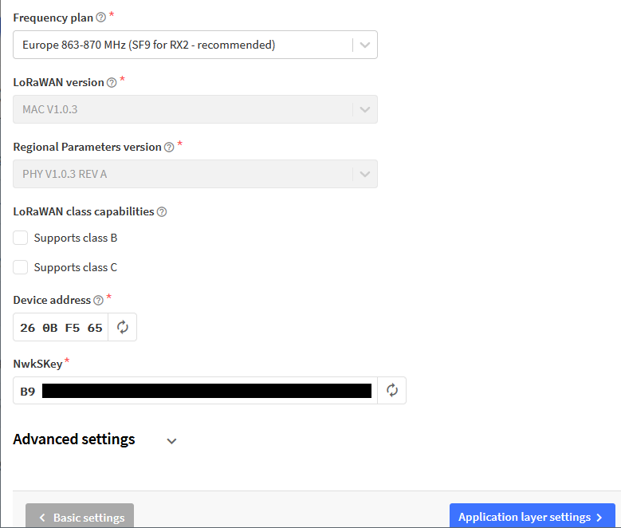
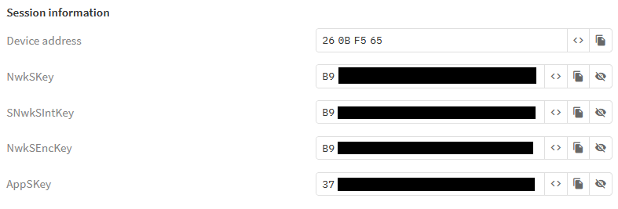
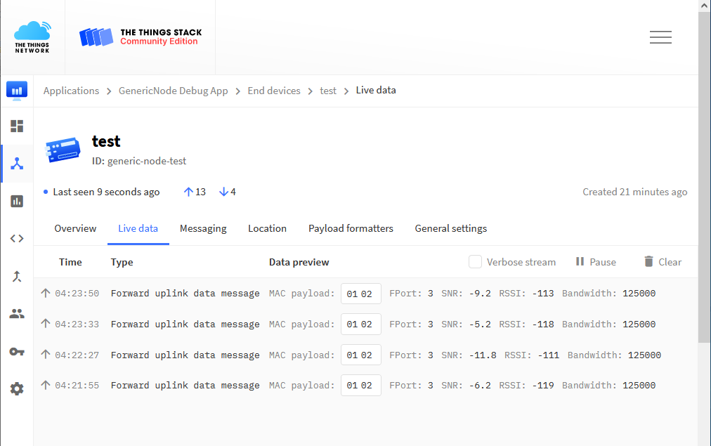
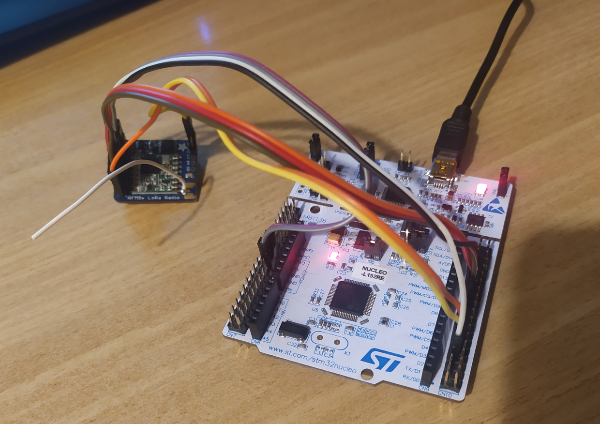

# Generic LoRa Node

## Description

This project builds open Arduino as the framework and [Arduino-LMIC](https://github.com/mcci-catena/arduino-lmic/) (LoRa-MAC-in-C) to create a firmware which gives a user easy access to LoRa and LoRaWAN functionality, such as configuring ABP or OTAA keys, sending LoRaWAN packets, receiving LoRaWAN packets, etc. 

In short this means that you can grab any of the supported development boards you like, connect a LoRa radio to it, flash the firmware onto the dev board and start sending LoRa packets.

The firmware is basically [ttn-abp.ino](https://github.com/mcci-catena/arduino-lmic/blob/master/examples/ttn-abp/ttn-abp.ino) and [ttn-otaa.ino](https://github.com/mcci-catena/arduino-lmic/blob/master/examples/ttn-otaa/ttn-otaa.ino) on steroids, with more functionality coming soon.

## Supported Hardware

LoRa radios:
* Semtech SX1276
* Semtech SX1272
* RFM95 (which is a SX1276 clone), e.g. [this Adafruit module](https://learn.adafruit.com/adafruit-rfm69hcw-and-rfm96-rfm95-rfm98-lora-packet-padio-breakouts/overview)

Boards and microcontrollers:
* STM32 ones, e.g. [Nucleo L152RE](https://os.mbed.com/platforms/ST-Nucleo-L152RE/), [Nucleo L476RG](https://os.mbed.com/platforms/ST-Nucleo-L476RG/)
* [ESP32](https://github.com/espressif/arduino-esp32#esp32dev-board-pinmap)
* Atmel SAMD boards (e.g, the handy [Adafruit Feather M0 with RFM95 radio](https://learn.adafruit.com/adafruit-feather-m0-radio-with-lora-radio-module/overview))
* possibly many more since it justs builds on Arduino + LMIC.


## Firmware Compilation and Flashing

This project is designed to be compiled with [PlatformIO](https://platformio.org/) as the build system. To obtain PlatformIO, 
1. Go the commandline way: `pip3 install platformio` ([docs](https://docs.platformio.org/en/latest/core/installation.html#python-package-manager)), or
2. Go the IDE way: [Download](https://code.visualstudio.com/download) and install VSCode, then [add the PlatformIO extension](https://docs.platformio.org/en/latest/integration/ide/vscode.html#installation) to it from the marketplace

The project can then be interacted with from either the CLI or the IDE.

First, you need to know which PlatformIO environment you are building for. Each corresponds to a certain board / microcontroller. They are listed in the [platformio.ini](platformio.ini) as `[env:<environment name>]`. For example, the environment for the Nucleo L152RE board is `nucleo_l152re`.

In VSCode's [project task list](https://docs.platformio.org/en/latest/integration/ide/vscode.html#project-tasks), all environments are listed, and when expanded show the "Build" and "Upload" buttons to respectively compile and upload the project for that specific environment.


If you are working from the CLI, use `pio run -e <environment>` for building and `pio run -e <environment> -t upload` accordingly ([docs](https://docs.platformio.org/en/latest/core/quickstart.html#process-project)).

## Hardware Hookup 

The hardware should consist of a development board (with on-board USB-UART chip or the MCU being USB capable) with one of the LoRa radios listed above connected to it.

The pins to which the radio should be connected to is listed in [`src/HardwarePinConfig.cpp`](src/HardwarePinConfig.cpp). Note that the SPI connections should always be made to the default pins that the Arduino core's SPI library uses. 

In the example of the (STM32) [Nucleo-L152RE](https://os.mbed.com/platforms/ST-Nucleo-L152RE/#board-pinout) board with a [Adafruit RFM95 breakout board](https://learn.adafruit.com/adafruit-rfm69hcw-and-rfm96-rfm95-rfm98-lora-packet-padio-breakouts/pinouts), this means:
* Nucleo's 5V to radio's VIN pin (breakout board has voltage regulator on-board, 5V can source more current..)
* Nucleo's GND to radio's GND pin
* Nucleo's SCLK to radio's SCLK pin (as labelled on the Arduino-compatible header of the Nucleo, `SPI1_SCLK` / PA5)
* Nucleo's MISO to radio's MISO pin 
* Nucleo's MOSI to radio's MOSI pin 
* Nucleo's D10 to radio's CS pin (as dictated by the `HardwarePinConfig.cpp`)
* Nucleo's D3 to radio's G0 pin (G0 = DIO0)
* Nucleo's D4 to radio's G1 pin
* Nucleo's D5 to radio's RST pin

Your radio should have an antenna connected to it. If not, Follow the [Adafruit guide](https://learn.adafruit.com/adafruit-rfm69hcw-and-rfm96-rfm95-rfm98-lora-packet-padio-breakouts/assembly) to learn how to construct a quarter wave-length antenna for the frequency / region you're working with.

The SPI and two DIO interrupt pins are usually the only things needed to talk to the radio. Some hardware may require more pins like an antenna switch (rx/tx switch), a power pin that you must enable before, etc. In this case, modify the LMIC configuration file and `HardwarePinConfig.cpp` as needed, in accordance to the LMIC documentation.

# LMIC Configuration

The LMIC configuration header file is [`src/genericnode_lmic_config.h`](src/genericnode_lmic_config.h). In there, you can change settings for the region (e.g., EU868, US915, ..),  used LoRa radio (SX1272/SX1276) and debug output verbosity. The standard settings are EU868 and SX1276. 

The [`src/HardwarePinConfig.cpp`](src/HardwarePinConfig.cpp) file additionally creates the `lmic_pins` object which LMIC uses to for interacting with the hardware.

Refer to [Arduino-LMIC's documentation](https://github.com/mcci-catena/arduino-lmic/#configuration) for further details on what configuration options are available.

Also note that the list of activated channels is done in [`src/LoRaWANManager.cpp`](https://github.com/maxgerhardt/generic-lora-node/blob/1a352b61ff6c82c8ec0c7d2852422234fe3b7acb/src/LoRaWANManager.cpp#L31-L75). You may disable channels as needed, but LMIC will *always* at least use the 3 mandatory channels as specified by LoRaWAN.

## User Manual

Hook up the hardware to the microcontroller and flash the firmware on it as described above. Also see the 'Firmware flashing example' chapter below for a concrete example.

The user can interact with the firmware with a serial connection, done using the standard `Serial` Arduino object, at 115200 baud. This is usually a UART output which on a dev board is connected to a USB-UART converter which can be in turn connected to via a USB cable. Some microcontrollers (like the above listed Adafruit Feather M0, Atmel SAMD21) do not need this because the chip is USB capable, and thus if you flash the firmware on it, it will expose a virtual serial port via USB.

Assuming you are using VSCode + PlatformIO, use the [project task](https://docs.platformio.org/en/latest/integration/ide/vscode.html#project-tasks) "Uplaod and Monitor" to swiftly upload the firmware and open a serial monitor to the dev board in one swift go. Otherwise, use any terminal program, like [PuTTY](https://www.putty.org/) or [miniterm.py](https://helpmanual.io/help/miniterm.py/) to open a serial connection to the development board at 115200 baud (and standard 8N1 configuration).

You should be greeted with

```
Firmware start!
Initializing EEPROM
user_loaded: 0x0
Initializing LoRaWAN stack.
RXMODE_RSSI
Not loading any keys., method = 0
What action would you like to do? 
```

The interface is text and command-based. Type 'help' to receive a list of all possible commands.

```
Available commands: (Commands in round brackets are optional)
        erase                                        Erases the current node configuration
        printcfg                                     Prints the current node configuration
        set_tx_sf (sf)                               Sets the TX spreading factor
        set_rx2_sf (sf)                              Sets the SF in RX2
        set_abp_keys (devaddr) (appskey) (nwskey)    Sets the keys for Activation by Personalization
        set_otaa_keys (appeui) (deveui) (appkey)     Sets the keys for Over-the-Air Activation
        set_opmode (0=None/1=LoRaWAN/2=LoRa)         Sets the to be used activation method    
        set_activation_method (0=None/1=ABP/2=OTAA)  Sets the to be used activation method
        set_framecnt_up (num)                        Sets the uplink framecounter
        set_framecnt_down (num)                      Sets the downlink framecounter
        join                                         Starts the OTAA join procedure
        disconnect                                   Disconnects a device that joined via OTAA for re-joining (with different keys)
        lorawan_send (fport) (data) (conf.)          Sends a payload via LoRaWAN
        repeat (num_reps or -1) (delay_secs)         Repeats the last LoRaWAN transmission a number of times.
        check_radio                                  Checks if the LoRa radio is present
        shutdown                                     Shuts down the LoRa(WAN) stack
        reboot                                       Reboot microcontroller
        help                                         Prints all available commands
```

This list is subject to change and expansion. The [`src/CommandExecutor.cpp`](src/CommandExecutor.cpp) holds the command table for all available commands.

Most commands can be used int two ways: 
* in `<command> <parameter values>` form, giving it directly all needed parameters, or
* `<command>`, after which the firmware will interactively ask you for the needed values.

Example: 

```
What action would you like to do? set_tx_sf
Your answer was: "set_tx_sf" (length 9)
Enter the SF used for transmission [7-12] 9
Saving new SF = 9
```

Is equivalent to 

```
What action would you like to do? set_tx_sf 9
Your answer was: "set_tx_sf 9" (length 11)
Saving new SF = 9
```

Note that the firmware saves some [configuration values](src/ConfigManager.h) in non-volatile (Flash/EEPROM) memory, such as LoRaWAN keys and other MAC settings. This is so that you don't have to re-enter them every time. These values are e.g.:
* the LoRaWAN ABP and OTAA keys
* framecounters (up + down)
* last SF used for transmission (TX) 
* last SF set as the RX2 SF (e.g., SF9 for TTN)
* TX power
* ADR activated
* etc. 

The current state of the configuration can be inspectec with the `printcfg` command and reset to default values using the `erase` command.

## Usage example

Given a board with the firmware flashed and the hardware connected to it, we can start sending some LoRaWAN data. In this example, the TTN network is used, horever, any other LNS (e.g., custom Chirpstack instances) also work. Refer to their documentation on how to add a application, end device, gateway etc. there.

In order to send data, we first need to register our LoRaWAN device with our LNS (her: TTN) in order to obtain some LoRaWAN keys (via the ABP or OTAA method). With these keys then, the device can join the LoRaWAN network and talk to the LNS (and possibly another application behind it).

Log into https://console.cloud.thethings.network/ using your TTN account (or create one). 

Create an [application](https://www.thethingsindustries.com/docs/integrations/adding-applications/) as a base. The application name and ID can be arbitrary.


Now you can add a new [end device](https://www.thethingsindustries.com/docs/devices/adding-devices/). As a first example, we want to use the ABP method (no lenghty OTAA join procedure..), so these settings are chosen. Note that due to using LMIC, we need to select LoRaWAN MAC version 1.0.3, as that is the latest versions supported by LMIC.



Next we choose an arbitrary name, DevEUI etc.



Next we setup the frequency plan and (random) keys. I will use the recommended EU868 settings here, with the RX2 window using spreading factor 9. This will be important to memorize later for the MAC settings. Note down the device address and NwkSKey, as those are needed to later. They can also be viewed again in the device details at any point later.



In the last page, we are asked to enter the AppSKey. Generate a random one and note it down, then hit 'hit end device'.


The final device overview page again shows the keys, which are copy-pastable.




Finally, onto the firmware. As per the chapter above, establish a serial connection to the board. 

We will first erase the old configuration with `erase`.

```
What action would you like to do? erase
Your answer was: "erase" (length 5)        
Erasing old config and loading default one.
Erased.
```

Next we will use the `set_abp_keys` command with no arguments to save the ABP keys into the device in an interactive way, with the values copy-pasted from the TTN console. Actual keys are blacked out in this example.

```
What action would you like to do? set_abp_keys
Your answer was: "set_abp_keys" (length 12)
Enter Device Address [4 Bytes] 260BF565
Enter AppSKey [16 Bytes] 37XXXXXXXXXXXXXXXXXXXXXXXXXXXXXX
Enter NwkSkey [16 Bytes] B9XXXXXXXXXXXXXXXXXXXXXXXXXXXXXX
Read device address: 0x260bf565
Read AppSKey: 37 xx xx xx xx xx xx xx xx xx xx xx xx xx xx xx
Read NwkSkey: b9 xx xx xx xx xx xx xx xx xx xx xx xx xx xx xx
Setting ABP session keys.
Saved and reloaded new configuration.
```

Note that executing `set_abp_keys (devaddr) (appskey) (nwskey)` is equivalent to that.

Setting the ABP keys also automaticall sets the activation mode (manually configurable by `set_activation_method`) to ABP and the operation mode (manually configurable by `set_opmode`) to LoRaWAN. 

If we want to be able to receive downlink sent to the device, we also need to setup the proper RX2 parameters for our LNS. In the case of TTN, that is: RX2 is using SF9. So, we execute

```
What action would you like to do? set_rx2_sf 9
Your answer was: "set_rx2_sf 9" (length 12)
Saving new RX2 SF = 9
Setting ABP session keys.
```

Before the transmission we can set the spreading factor to use, between 7 and 12. Lower SF means shorter transmission and a smaller duty-cycle, but also shorter range. In this example I'm choosing SF9.

```
What action would you like to do? set_tx_sf 9
Your answer was: "set_tx_sf 9" (length 11)
Saving new SF = 9
Setting ABP session keys.
```

**Finally**, we can transmit actual data. Make sure to first open the "Live data" tab in the TTN console for the device to be able to see it. Then, using the command `lorawan_send (fport) (data) (conf.)` we can send some data (hex encoded) on some FPort, either as confirmed uplink or not (default: no). 

Let's transmit the payload (hex) `01 02` on FPort 3 as unconfirmed uplink.

```
What action would you like to do? lorawan_send 3 0102
Your answer was: "lorawan_send 3 0102" (length 19)
Transmission params:
        Fport: 3
        Payload: 01 02
        Confirmed up: 0
156388053: EV_TXSTART
156388324: TXMODE, freq=868300000, len=15, SF=9, BW=125, CR=4/5, IH=0
Packet queued
What action would you like to do? 156460138: setupRx1 txrxFlags 00 --> 01
start single rx: now-rxtime: 10
156460953: RXMODE_SINGLE, freq=868300000, SF=9, BW=125, CR=4/5, IH=0
rxtimeout: entry: 156463095 rxtime: 156460762 entry-rxtime: 2333 now-entry: 12 rxtime-txend: 62126
156522387: setupRx2 txrxFlags 0x1 --> 02
start single rx: now-rxtime: 10
156523203: RXMODE_SINGLE, freq=869525000, SF=9, BW=125, CR=4/5, IH=0
rxtimeout: entry: 156525859 rxtime: 156523012 entry-rxtime: 2847 now-entry: 11 rxtime-txend: 124376
156526454: processRx2DnData txrxFlags 0x2 --> 00
156526733: processDnData_norx txrxFlags 00 --> 20
```

You can see that the payload was accepted and immediately, LMIC has scheduled and started transmission of the LoRaWAN payload, on SF9 and the channel with frequency 868.3 MHz. Then, as specified for Class-A devices, the device waits for payload in the RX1 window at the same frequency and SF as during the transmission, and finally the RX2 window with a fixed channel (869.525MHz) at SF9. 

Note that radio transmissions with LoRaWAN are inherently lossy if no mechanism like confirmed-uplink (aka, retrying to send the packet until an ACK is received) is used. 

The firmware, through the `repeat` commands, offers a convient way to repeat the last transmission a fixed number of times, or `-1` for infinite, with some given amount of seconds as delay between the transmissions.

Here I use the command to do infinite repitions with a 10 seconds delay. Note that the duty cycle applies at all time and is enforced by LMIC, this means you can't e.g. send 20 SF12 transmissions directly behind each other, because you have to wait a certain amount of time proportional to the used transmission time before being allowed to transmit again.

```
What action would you like to do? repeat -1 10
Your answer was: "repeat -1 10" (length 12)
Repeating last transmission infinite times, delay 10 seconds.
Transmission data: 0102 Fport 3
175072456: EV_TXSTART
175072732: TXMODE, freq=867700000, len=15, SF=9, BW=125, CR=4/5, IH=0
...
```

And looking at the TTN console, some incoming payload can then be observed. If a particular packet is received of course depends on the radio link and other (interfering) radio network members, so don't be suprrised if some packets are dropped.
 


To stop the transmission, use `shutdown`. The firmware must then be restarted using `reboot`.

## Notes on OTAA and TTN 

For OTAA, use the `set_otaa_keys` command. Note that when using TTN, the EUI parameters (AppEUI and DevEUI) are displayed most-significant-byte (MSB) first, but the LMIC stack needs it in least-significant-byte format, as noted in [the code](https://github.com/maxgerhardt/generic-lora-node/blob/340b5cfadb495b6d2badbb65223af64444832bf9/src/LoRaWANManager.cpp#L227-L237). 

In practice that means that you must read the EUIs byte-wise backwards. So e.g., the string `01 02 03` becomes `03 02 01`. The AES-keys (aka AppKey) need to be in unmodified MSB format though.

You do not need to issue an explicit command to join the network (OTAA join procedure). When you've setup the keys, issuing the command to send LoRaWAN data suffices. 

You can still however use the `join` command which will explicitly tell LMIC to execute **one** OTAA join try. The command additionally does a little modification to use SF12 as the beginning spreading factor, speading up join procedures if the node has a weak connection to the gateways of the LNS, so that it doesn't need to start at SF7 and slowly work itself up to a SF where it is heard.

## Adding another board

Your board is not listed in the `platformio.ini`? Try looking up the board in [PlatformIO's board list](https://platformio.org/boards) and adding a new environment for it, in accordance to what the other environments do. For example, for the [Nucleo F103RB](https://docs.platformio.org/en/latest/boards/ststm32/nucleo_f103rb.html) board, add 

```ini
[env:nucleo_f103rb]
platform = ststm32
board = nucleo_f103rb
framework = arduino
lib_deps = ${common_env_data.lib_deps_always}
```

to the `platformio.ini` and build for that environment. Many boards supporting Arduino are likely fully compatible. 

If the firmware is not working or help is needed, please open an issue.

## Firmware flashing example 

Given a Nucleo L152RE environment, using the "Upload and Monitor" project task in VSCode + PlatformIO, or `pio run -e nucleo_l152re -t upload -t monitor`, should give

```
Processing nucleo_l152re (platform: ststm32; board: nucleo_l152re; framework: arduino)
-------------------------
Verbose mode can be enabled via `-v, --verbose` option
CONFIGURATION: https://docs.platformio.org/page/boards/ststm32/nucleo_l152re.html
PLATFORM: ST STM32 (14.0.1) > ST Nucleo L152RE
HARDWARE: STM32L152RET6 32MHz, 80KB RAM, 512KB Flash
DEBUG: Current (stlink) On-board (stlink) External (blackmagic, cmsis-dap, jlink)
PACKAGES:
 - framework-arduinoststm32 4.20000.210603 (2.0.0)
 - framework-cmsis 2.50700.210515 (5.7.0)
 - tool-dfuutil 1.9.200310
 - tool-openocd 2.1100.0 (11.0)
 - tool-stm32duino 1.0.2
 - toolchain-gccarmnoneeabi 1.90201.191206 (9.2.1)
LDF: Library Dependency Finder -> http://bit.ly/configure-pio-ldf
LDF Modes: Finder ~ chain, Compatibility ~ soft
Found 11 compatible libraries
Scanning dependencies...
Dependency Graph
|-- <MCCI LoRaWAN LMIC library> 4.0.0
|   |-- <SPI> 1.0
|-- <SPI> 1.0
|-- <EEPROM> 2.0.1
Building in release mode
Compiling .pio\build\nucleo_l152re\FrameworkArduinoVariant\PeripheralPins.c.o
..
Linking .pio\build\nucleo_l152re\firmware.elf
Checking size .pio\build\nucleo_l152re\firmware.elf
Advanced Memory Usage is available via "PlatformIO Home > Project Inspect"
RAM:   [          ]   3.4% (used 2780 bytes from 81920 bytes)
Flash: [=         ]  10.8% (used 56512 bytes from 524288 bytes)
Configuring upload protocol...
AVAILABLE: blackmagic, cmsis-dap, jlink, mbed, stlink
CURRENT: upload_protocol = stlink
Uploading .pio\build\nucleo_l152re\firmware.elf
xPack OpenOCD, x86_64 Open On-Chip Debugger 0.11.0-00155-ge392e485e (2021-03-15-16:44)
..
** Verified OK **
** Resetting Target **
shutdown command invoked
=========================== [SUCCESS] Took 17.38 seconds ===========================
--- Available filters and text transformations: colorize, debug, default, direct, hexlify, log2file, nocontrol, printable, send_on_enter, time
--- More details at http://bit.ly/pio-monitor-filters
--- Miniterm on COM14  115200,8,N,1 ---
--- Quit: Ctrl+C | Menu: Ctrl+T | Help: Ctrl+T followed by Ctrl+H ---
Firmware start!
[..]
What action would you like to do? 
```

## Media

A Nucleo-L152RE board with a Adafruit RFM95 breakout board attached to it, running the firmware.



## Current State

Implemented:
* [x] LoRaWAN key configuration (OTAA, ABP)
* [x] LoRaWAN packet sending with configurable payload and FPort
* [x] Setup repeated transmissions
* [ ] Using ADR
* [ ] Sending / Receiving on a fixed channel (currently uses all available channels)
* [ ] continuous receive (Class-C dvevice)
* [ ] Continous Wave (CW) test output
* [ ] Sending and receiving raw LoRa packets